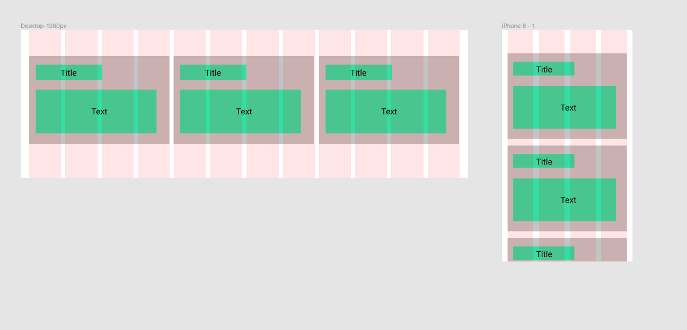

Frontend Exercise 
=================

Build a component that visualizes data in a responsive grid layout. Try to only use the packages which are 
already defined in the package.json.

#### Task 1: Grid layout with cards 

Implement a simple grid layout. Input data is provided in the file data.js. Each element in the data array is 
supposed to be displayed on a card. 
The number of elements in the data array might vary in the future. 
Therefore, make sure that your component supports a variable number of input elements. We usually expect 4 elements.

 

#### Task 2: Add a rating feature

We want to give the user the ability to rate the content on each card.
Implement a star rating component. A functional component "Star" is already provided in
"src/components/StarRating/index.js". Implement a component "StarRating" which contains the logic. 
Store the current star rating in the components state. 
An implementation with React Hooks is preferred. Add the StarRating component on each card.

